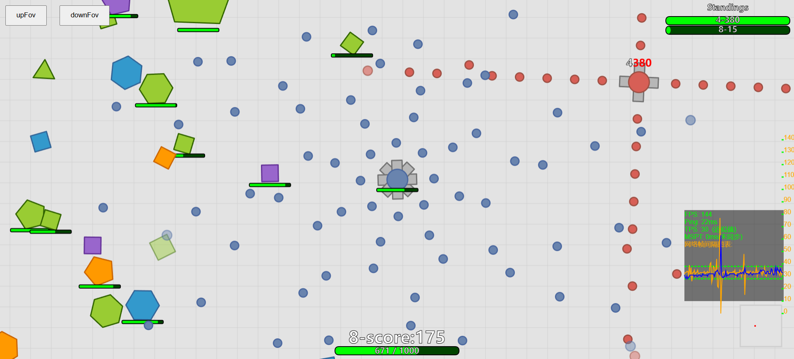
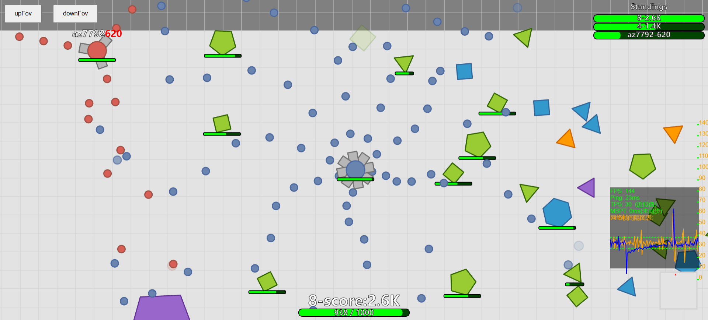

## 项目概述
本项目是一个基于ECS与Box2D的网页射击游戏，基础玩法仿照[diep.io](https://diep.io/)设计，服务端采用C++实现，客户端采用JavaScript结合Canvas实现。

**预计实现的系统：**

- 开火系统：向指定方向发射子弹。
- 伤害判定系统：判断实体之间的碰撞并结算伤害。
- 摄像机系统：维护每个玩家摄像机范围内的实体，用于数据同步。
- 积分系统：玩家击败其他拥有积分组件的实体时会按比例获取积分，积分可用于玩家升级和加点，也可用于维护积分排行榜并同步给所有客户端。
- 输入系统：接收玩家的输入，并同步给ECS。
- 输出系统：将需要同步的数据发送给玩家客户端。
- 实体生成系统：用于生成各种实体（不同角色，子弹，资源方块）。
- 实体控制系统：用于控制角色移动，方块公转自转等运动。
- 玩家升级系统：通过玩家拥有的积分来升级到不同的角色。
     - **未实现**
- 加点系统：用于强化玩家的基础属性，如移动速度，血量等。
     - **未实现**
- 道具系统：玩家可拾取并使用的道具（例如：缓慢回血、瞬间回复、增加移速、探测一定范围内的玩家、短暂无敌，隐身等）。
     - **未实现**
- 子弹系统：更多种类的子弹（例如：普通、追踪、爆炸、陷阱、可控制轨迹等不同效果的子弹）。
     - **只实现了最普通的子弹**
- 进化护甲系统：玩家通过攻击其他玩家达到一定数值可以升级自己的护甲等级（例如：白、绿、蓝、紫、金、红等不同级别的护甲）。
     - **未实现**
- 指令系统：用于在游戏程序运行时进行手动控制（例如关闭服务器）。
     - **只实现了关闭服务器指令**

**\*部分系统合并写在了一起，实际使用的系统如下：**

```cpp
em_.addSystem(std::bind(&GameLoop::inputSys, this))
     .addSystem(std::bind(&GameLoop::destroyEntitySys, this))
     .addSystem(std::bind(&GameLoop::createPlayerSys, this)) // 先删再创建能回收一部分实体标识符
     .addSystem(std::bind(&playerMovementSys, std::ref(em_), std::ref(worldId_)))
     .addSystem(std::bind(&TestRegularPolygonSys, std::ref(em_), std::ref(worldId_), std::ref(tick_)))
     .addSystem(std::bind(&TestFireSys, std::ref(em_), std::ref(worldId_), std::ref(tick_)))
     .addSystem(std::bind(&physicsSys, std::ref(worldId_)))
     .addSystem(std::bind(&blockRotationCtrlSys, std::ref(em_)))
     .addSystem(std::bind(&blockRevolutionCtrlSys, std::ref(em_), std::ref(worldId_)))
     .addSystem(std::bind(&contactListSys, std::ref(em_), std::ref(worldId_), std::ref(tick_)))
     .addSystem(std::bind(&attackSys, std::ref(em_), std::ref(worldId_), std::ref(tick_)))
     .addSystem(std::bind(&restoreHPSys, std::ref(em_), std::ref(worldId_), std::ref(tick_)))
     .addSystem(std::bind(&cameraSys, std::ref(em_), std::ref(worldId_), std::ref(tick_)))
     .addSystem(std::bind(&GameLoop::delayDeleteShapesSys, this))
     .addSystem(std::bind(&GameLoop::outputSys, this))
     .addSystem(std::bind(&GameLoop::outputStandingsSys, this));
```
游戏画面：





**\*分数与排行榜不一致是由于排行榜是1s同步一次**

游戏游玩相关：

- `WASD`进行上左下右移动
- `鼠标移动`控制炮管旋转
- `鼠标左键`进行射击
- `E`切换自动开火
- 玩家一段时间不受伤害会获得一段时间的回血效果
- 实体满血时不显示血条
- 其他玩家头上白色的是名称，红色的是分数，操作者本人的消息显示在屏幕下方

## 如何开始

### 服务器端
```
本项目使用Cmake 3.22.1版本及C++17标准编译
确保您的开发环境已经安装上述依赖后，运行 run.sh 脚本即可启动服务器端
```
### 客户端
客户端采用纯JavaScript编写，无需依赖
只需实现将服务器端文件转发给浏览器即可，若需要部署到服务器，需要更改./ShapeWars/const.js 中的WebSocket连接的服务器地址
以下是一个居于Flask的HTTP服务器，可以将服务器端的文件转发给浏览器
```python
# 一个简单http服务器
from flask import Flask, send_from_directory
import os

app = Flask(__name__)

# 设置静态文件夹
app.static_folder = "ShapeWars"
app.static_url_path = "/ShapeWars"

# 处理根路径，返回 index.html
@app.route("/")
def serve_index():
        return send_from_directory(os.path.abspath(os.path.dirname(__file__)), "index.html")

# 处理 ./ShapeWars/... 的请求
@app.route("/ShapeWars/<path:filename>")
def serve_shapewars(filename):
    return send_from_directory(os.path.join(os.path.dirname(__file__), "ShapeWars"), filename)

if __name__ == "__main__":
    app.run(debug=True, port=7777, host="0.0.0.0")
```

## 项目结构
```
.  
├── docs  # 文档
├── ShapeWars  # 客户端源代码
├── include  # 头文件
├── src  # 源代码
├── lib  # 静态库文件
├── test  # 测试
├── index.html  # 网站主页
├── main.cpp  # 主程序文件  
├── run.sh  # 运行脚本  
├── CMakeLists.txt  # CMake项目配置文件  
├── LICENSE
└── README.md
```

## 许可证

本项目基于 MIT 许可证，详细信息请查看 [LICENSE](https://github.com/az7792/ShapeWars/blob/master/LICENSE) 文件。

## 日志

你可以查看手写的[开发日志](https://github.com/az7792/ShapeWars/blob/master/docs/dev_log.md)或者Git日志来了解项目的开发进度或历史。
